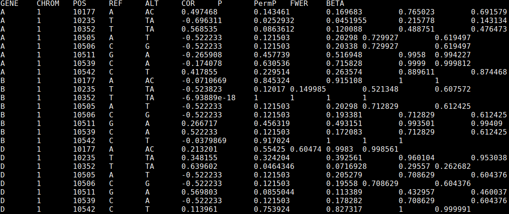

# veqtl-mapper

Genetic loci which are associated with the variance, rather than the mean, of a trait are known as v-eQTL. These can indicate the presence of genetic interactions, gene-environment interactions, parent of origin effects, linkage with mean effect variants, or canalisation. This package provides a tool for discovering these loci affecting molecular phenotypes.

***

## Contents

1. [Downloading veqtl-mapper](#downloading-veqtl-mapper)
2. [Input data formats](#input-data-formats)
3. [Mapping v-eQTL](#mapping-v-eqtl)
4. [Mapping variance effects related to parent of origin eQTL](#mapping-variance-effects-related-to-parent-of-origin-eqtl)
5. [Processing results](#processing-results)
6. [Building from source](#building-from-source)

***

## Downloading veqtl-mapper

veqtl-mapper binaries can be downloaded from here:

[https://github.com/funpopgen/veqtl-mapper/releases/tag/1.01](https://github.com/funpopgen/veqtl-mapper/releases/tag/1.01)

The standard binary is called veqtl-mapper. Use veqtl-mapper_CentOS if there is an error referring to GLIBC.

veqtl-mapper requires tabix to be installed, tabix can be found here: [https://github.com/samtools/htslib](https://github.com/samtools/htslib).

Sometimes, permissions have been stripped from the binaries. If you get a "Permission denied." error, this can be solved by running:

    chmod 755 veqtl-mapper

If there are any other issues, you can try [building from source](#building-from-source), or contact [andrew.brown@unige.ch](mailto:andrew.brown@unige.ch).

***

## Input data formats

veqtl-mapper uses the same data formats as fastQTL [http://fastqtl.sourceforge.net/](http://fastqtl.sourceforge.net/), with the exception that the bed file should be uncompressed. To convert the fastQTL bed file run the following line:

    gunzip myphenotypefile.bed.gz

***

## Mapping v-eQTL

v-eQTL, SNPs associated with the variance of gene expression, can be caused by epistasis, gene-environment interactions, and partial linkage with eQTL ([Brown et al., 2014](https://elifesciences.org/content/3/e01381)).

To run veqtl-mapper, all that is necessary is a bed file containing expression values (expression.bed) and a vcf file containing genotype values (genotype.vcf.gz, either the DS or GT field must be present).

veqtl-mapper has been designed so that the full analysis can be broken up into chunks, which can be submitted as cluster jobs separately. This requires two flags (if neither are present the whole analysis will be submitted), `--genes` specifies the number of genes to be analysed in each job, `--job-number` indexes the job. Therefore, if `--genes 10` is specified, `--job-number 1` will analyse genes 1-10 in the bed file, `--job-number 2` will process genes 11-20 and so on.

To submit a job array, with a bed file of 9,995 genes, where each job analyses 50 genes (9,995 / 50 = 199.9, so we need to run 200 jobs to cover all genes), we would submit the following command to an LSF cluster:

     bsub -o out -J"veqtl[1-200]" \
         "veqtl-mapper --bed expression.bed --vcf genotype.vcf.gz --genes 50 \
         --job-number \$LSB_JOBINDEX --out results\$LSB_JOBINDEX"

In addition, the `--perm` option allows you to set the number of permutations used in the analysis, and optionally a seed.

Each results file should look like this:

The first 5 columns indicate the gene and SNP (specified by chromosome, location, and reference and alternate alleles), then we report the Spearman correlation between the "distance" measure and genotype (positive indicates increased variance with the alternate allele), P value, permutation P value (not controlled for multiple testing), permutation P value controlled for multiple testing across the SNPs, and the beta approximation adjusted P value.

## Mapping variance effects related to parent of origin eQTL

Parent of origin eQTL occur when the effect of a genetic variant on expression depends on whether the variant is inherited from the mother or the father. Such effects can be observed as an increase in variance in the heterozygote group ([Hoggart et al., 2014](http://journals.plos.org/plosgenetics/article?id=10.1371/journal.pgen.1004508)). It is recommended that the genotype file only contain variants with reasonable numbers of minor allele homozygotes and heterozygotes if this analysis is run (we recommend more than 50 in both categories), as otherwise standard v-eQTL could mistakenly be discovered. The command to run this analysis is the same as the standard analysis, with the addition of the flag `--het`:

     bsub -o out -J"parent[1-200]" \
         "veqtl-mapper --bed expression.bed --vcf genotype.vcf.gz --genes 50 \
         --job-number \$LSB_JOBINDEX --het --out results\$LSB_JOBINDEX"

## Processing results

Running the commands described above will produce 200 results files, results1-results200. To concatenate them together run:

     awk 'FNR>1||NR==1' results* > results.all

To extract the most significant association for each gene, run the following command:

    (head -1 results.all; tail -n+2 results.all |  \
        awk '{if (best[$1]=="" || p_best[$1] > $7) {best[$1] = $0; p_best[$1]=$7}} \
	    END{for (var in best) print best[var]}') > results.best

The results are corrected for multiple testing across the SNPs. To correct for multiple testing across the genes as well, we can use the [qvalue package](http://genomine.org/papers/Storey_FDR_2011.pdf) in R.

Within R, load the data with the following command:

    results <- read.table(file = "results.best", header = T)

A new object with adjusted P values can then be calculated:

    library(qvalue)
    results <- data.frame(results, Qvalues = qvalue(results$BETA)$qvalues)

To write out this table, run:

    write.table(results, file = "results.adjusted", col.names = T, row.names = F, sep = '\t', quote = F)

The final column in results.adjusted now contains Q values, which sets a threshold for estimating the false discovery rate while accounting for all SNPs and genes tested.
    
***

## Building from source

This requires a D compiler and a version of the GNU scientific library to be installed. Running the command:

    gsl-config --version

should report the gsl version. If this fails, please follow the instructions [here](https://www.gnu.org/software/gsl/) to install the library, or contact your system administrator.

### Cloning the repository

First, clone the repository by running:

    git clone https://github.com/funpopgen/veqtl-mapper.git

This should create a folder called veqtl-mapper. Inside this folder is a file called makefile, in the first two lines we can specify the location of the D compiler.

### Download a D compiler

Then, download a D compiler from either here: [https://github.com/ldc-developers/ldc/releases](https://github.com/ldc-developers/ldc/releases) or here: [http://dlang.org/dmd-linux.html](http://dlang.org/dmd-linux.html) (ldc produces faster software, my experience is that dmd works better on older operating systems). Decompress the downloaded file, then edit either the first or second line of the makefile in the veqtl-mapper folder so that it contains the full path to the relevant compiler, i.e. either:

**DMD = /path/to/dmd2/linux/bin64/dmd**

or

**LDC = /path/to/ldc2-1.1.0-beta2-linux-x86_64/bin/ldc2**

### Building the software

Now to compile, if you downloaded the ldc compiler, run the following command:

    make test && make

For dmd run:

    make dmd_test && make dmd

Now the veqtl-mapper binary should be within the bin folder in the veqtl-mapper directory, running

     ./bin/veqtl-mapper --help

should bring up the help.
